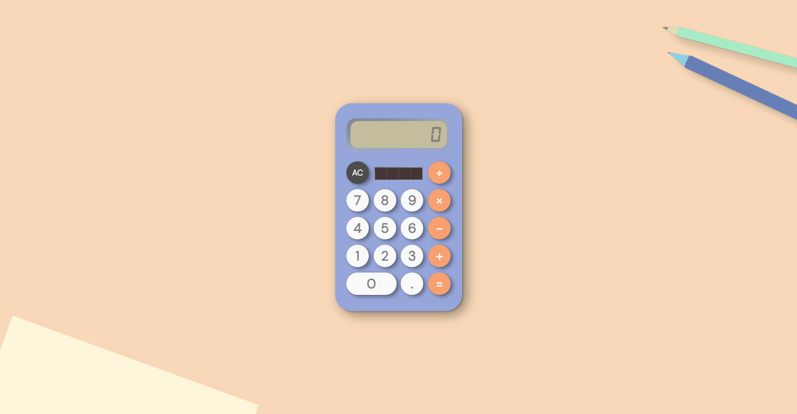

# JS Calculator

> _A simple, retro-style calculator app made using HTML, SCSS and vanilla JavaScript. The calculator accepts mouse and keyboard commands and outputs the result on the screen._</br>

#### Project link [_here_](https://jpthacker.github.io/punk-api/).

##

<p align="center">
  
</p>

## Approach

This calculator app required the functionality of a simple non-scientific calculator, i.e., it needed to be able to handle addition, subtraction, multiplication, division and clear/cancel.

To put my own twist on this classic challenge, I constructed a wireframe of a retro calculator complete with other desk items on Figma and styled the app accordingly using scss.

#### Take a look at the Figma wireframe [_here_](https://www.figma.com/file/fivaKGg3YGfE2XmDXKLh2H/js-calculator?node-id=2%3A2&t=DzYSeUrkj6jkuJV1-1).

To handle lengthy results in the display, I added a 'long' class to the "display" HTML element, which was applied when the 'innerText' of that element exceeded a certain amount of characters.

The app handles click and keyboard events, as illustrated below for the "cancel" button:

```javascript
const cancelBtn = document.querySelector(".calc__btn--cancel");
cancelBtn.addEventListener("click", handleCancel);
document.body.addEventListener("keydown", (event) => {
  event.preventDefault();
  if (event.key === "c") {
    handleCancel();
  }
});
```

## Technologies & Features:

- HTML5
- CSS/SCSS
- Vanilla JavaScript
- Mobile first / responsive design
- Git version control

## Further Developments:

- Revisit the screen overflow functionaility to make it more dynamic.
